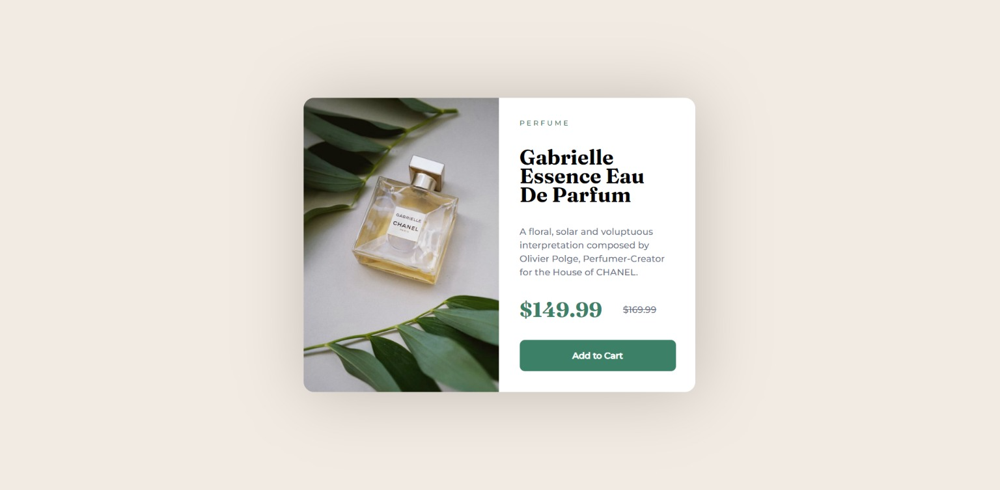

<h1>Product preview card component by FrontEnd Mentor</h1>

<h2>
  <a
    href="https://www.frontendmentor.io/challenges/product-preview-card-component-GO7UmttRfa"
    >=> Challenge Link</a
  >
</h2>
<h2>
  <a href="https://dinethlive.github.io/product-preview-card-component/">
    => My Solution ( DEMO )
  </a>
</h2>

<h2>=> FrontEnd Mentor Solution</h2>

<h2>=> My Solution ScreenShot</h2>

<h3>What I learned ?</h3>
<ul>
  <li>CSS FlexBox</li>
  <li>rem unit usage</li>
  <li>Responsive Design</li>
</ul>

<h4>Thank you FrontEnd Mentor</h4>
